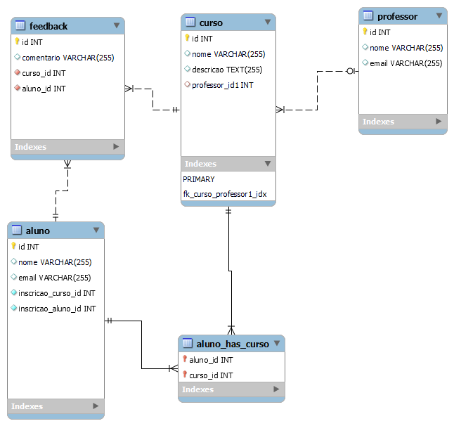

# 🧑🏽‍🏫Projeto ofertado na diciplina de POO do professor Gregory do Instituto federal do parana.

# 🌐Sistema Proposto 

## Meu sistema será utilizado para gerenciar cursos online. Ele permitirá que professores registrem cursos, alunos se inscrevam nos cursos e acompanhe seu progresso. Além disso, será possível adicionar avaliações para os cursos e feedback dos alunos para melhoria contínua.

# ☁️Modelo de Banco de Dados

## 🛑Requisitos para o banco de dados:
* Deve possuir no mínimo 4 tabelas.
* Deve ter ao menos uma tabela com chave estrangeira e relação 1 para muitos.
* Deve ter ao menos uma tabela de relação muitos para muitos.

---
