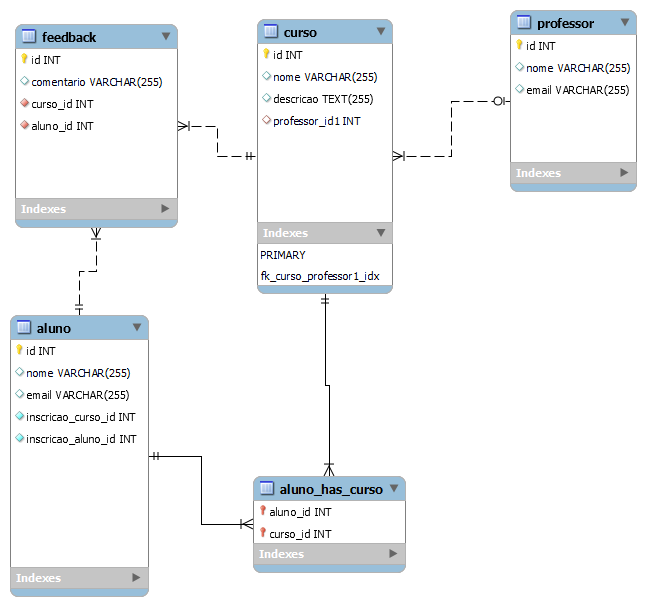

# 📚Projeto ofertado na diciplina de POO.

## 👨🏽‍💻Dev: Vagner Ferreira 
## 👨🏽‍🏫Professor: Gregory

# 🌐Sistema Proposto 

## Meu sistema será utilizado para gerenciar cursos online. Ele permitirá que professores registrem cursos, alunos se inscrevam nos cursos e acompanhe seu progresso. Além disso, será possível adicionar avaliações para os cursos e feedback dos alunos para melhoria contínua.

# ☁️Modelo de Banco de Dados



## 🛑Requisitos para o banco de dados:
* Deve possuir no mínimo 4 tabelas.
* Deve ter ao menos uma tabela com chave estrangeira e relação 1 para muitos.
* Deve ter ao menos uma tabela de relação muitos para muitos.

## 🛠️Tecnologias Utilizadas

O sistema será desenvolvido utilizando as seguintes tecnologias:

1. **Java 17**: A versão mais recente do Java, com melhorias significativas de desempenho e suporte a novas funcionalidades que facilitam o desenvolvimento de aplicações modernas.

2. **MySQL**: O banco de dados relacional será gerenciado através do MySQL, que permitirá armazenar informações dos cursos, alunos, professores, avaliações e feedback. O desenvolvimento será feito utilizando o **MySQL Workbench**, uma ferramenta que oferece uma interface gráfica para gerenciar e visualizar o banco de dados.

3. **JFrame**: A interface gráfica do usuário será construída com **JFrame**, permitindo a criação de janelas, botões e campos de entrada de dados para interação com os usuários.

4. **Apache NetBeans**: O **Apache NetBeans** será utilizado como IDE para desenvolvimento do sistema, oferecendo suporte completo ao Java, integração com o MySQL e ferramentas para a criação de interfaces gráficas com o JFrame.

Essas tecnologias permitem a criação de um sistema robusto, fácil de gerenciar e com uma interface amigável para o usuário.

## 🚀 Como Clonar e Rodar o Projeto

Este tutorial irá guiar você sobre como clonar o projeto e configurá-lo em seu ambiente de desenvolvimento.

### 1. **Clonar o Repositório**

Primeiramente, você precisará clonar o repositório do projeto para sua máquina local. Para isso, siga os seguintes passos:

1. Abra o terminal (ou Git Bash) na pasta onde deseja armazenar o projeto.
2. Execute o comando abaixo para clonar o repositório:

   ```bash
   git clone https://github.com/vagnerflj/Proposta-CRUD-IFPR.git


# 📊Diagrama de Classes 

# ⚒️Estrutura de Pacotes

```bash
    src/
│
├── conexao/
│   └── Conexao.java         
│
├── model/
│   ├── bean/
│   │   ├── Curso.java       
│   │   ├── Aluno.java       
│   │   ├── Professor.java   
│   │   └── Feedback.java    
│   ├── dao/
│       ├── CursoDAO.java    
│       ├── AlunoDAO.java    
│       ├── ProfessorDAO.java
│       └── FeedbackDAO.java 
│
├── views/
│   ├── CursoView.java       
│   ├── AlunoView.java       
│   ├── ProfessorView.java   
│   └── FeedbackView.java    
│
└── Main.java                
        
```


## 🛑REQUISITOS OBRIGATÓRIOS PARA O DIAGRAMA:
* Deve possuir ao menos duas classes com relacionamento de associação/agregação/composição;
* deve possuir no mínimo uma classe com associação de multiplicidade muitos para muitos (com array/arraylist);
* Requisito facultativo para o diagrama:
* Representar uma herança ou possibilidade de implementação de polimorfismo (herança com classe concreta/abstrata ou interface).

---


## 📬Endpoints do Sistema

| **Endpoint**               | **Método HTTP** | **Descrição**                                                   |
|----------------------------|-----------------|-----------------------------------------------------------------|
| `/login`                   | POST            | Realiza o login de um usuário (aluno/professor)                 |
| `/register`                | POST            | Registra um novo usuário                                        |
| `/cursos`                  | GET             | Retorna a lista de todos os cursos                              |
| `/curso/{id}`              | GET             | Detalhes de um curso específico                                  |
| `/curso`                   | POST            | Cria um novo curso                                              |
| `/curso/{id}`              | PUT             | Atualiza um curso existente                                     |
| `/curso/{id}`              | DELETE          | Deleta um curso                                                 |
| `/professores`             | GET             | Retorna lista de professores                                    |
| `/professor/{id}`          | GET             | Detalhes de um professor específico                              |
| `/professor`               | POST            | Registra um novo professor                                      |
| `/professor/{id}`          | PUT             | Atualiza um professor                                           |
| `/professor/{id}`          | DELETE          | Deleta um professor                                             |
| `/alunos`                  | GET             | Retorna lista de alunos                                         |
| `/aluno/{id}`              | GET             | Detalhes de um aluno                                            |
| `/aluno`                   | POST            | Registra um novo aluno                                          |
| `/aluno/{id}`              | PUT             | Atualiza informações de um aluno                                |
| `/aluno/{id}`              | DELETE          | Deleta um aluno                                                 |
| `/inscricao`               | POST            | Inscreve um aluno em um curso                                  |
| `/inscricoes/{aluno_id}`   | GET             | Retorna os cursos em que o aluno está inscrito                  |
| `/inscricao`               | DELETE          | Cancela inscrição de aluno em um curso                          |
| `/feedback`                | POST            | Deixa um feedback para um curso                                 |
| `/feedback/{curso_id}`     | GET             | Retorna os feedbacks de um curso específico                      |
| `/feedback/{id}`           | DELETE          | Deleta um feedback específico                                   |
